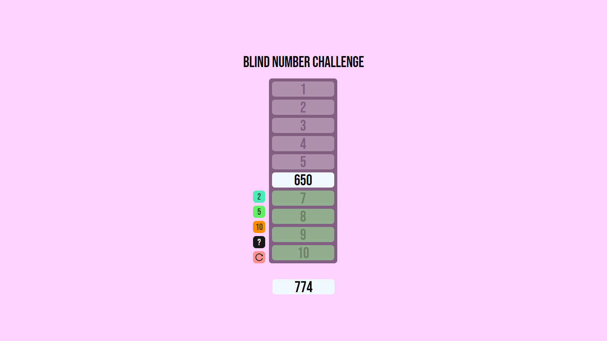

# Blind Number Challenge

## Description

This is a game where the player has to sort a list of numbers in ascending order. The game has been developed with React.

## Screenshots

## Rules

-   The player can only see the number that the game has generated.
-   The player can only move one number at a time.
-   The player can only move a number to an empty space.
-   The player wins if the list is sorted in ascending order.
-   The player loses if the game generates a number that don't have space to be placed.

## Technologies

-   [React](https://reactjs.org/): A JavaScript library for building user interfaces.

## Deployment

[Blind Number Challenge](https://amv1909.github.io/Blind-Number-Challenge/)
